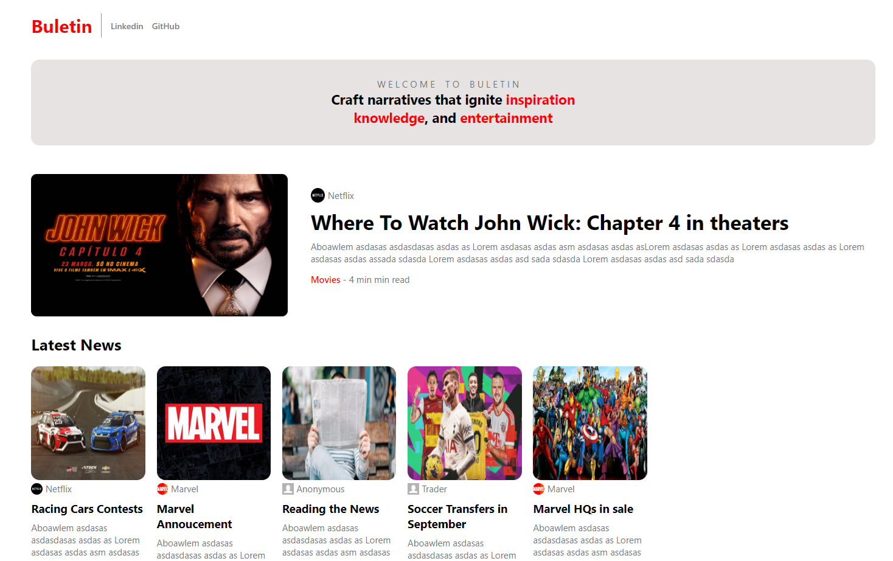
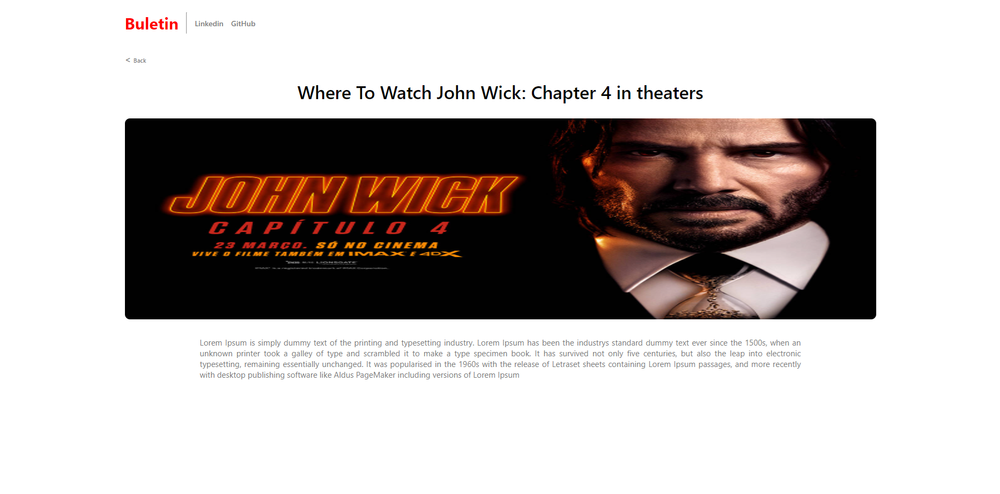

# Buletin Blog

A blog created with  **Angular** framework

## Home Page:

## Content Page:

## Components

Base components were used to create the pages:

- Large Card

- Small Card

- Menu bar

- Welcome card

A ***fake repository (dataFake)*** was used to dynamically insert content into the content page

## How to Run

Insert these comands in comand line

- `npm install` -> _Installs the project dependencies_

- `ng serve` -> _Starts the Angular application in a development server_

If you want Angular to open automatically in the browser, use:

- `ng serve --open`

>[!NOTE]
>
>Layout used to create the blog available [here](idea)

